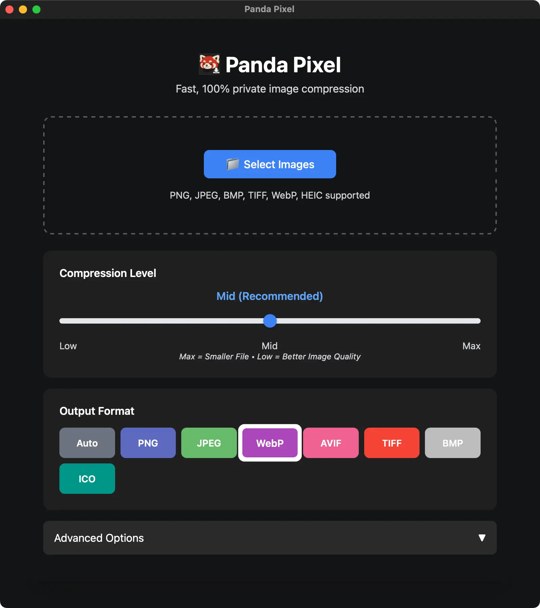
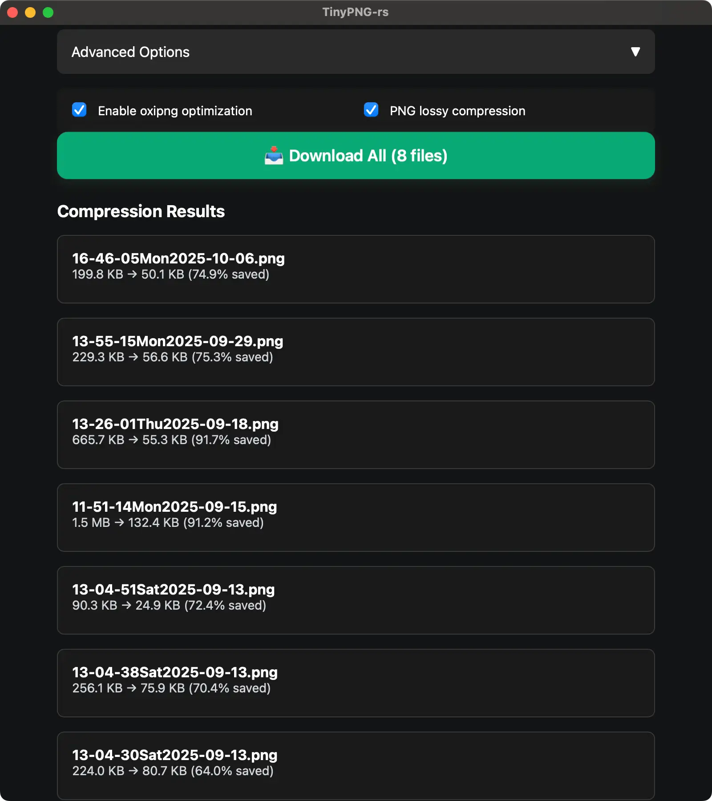

<div align="center">

#  TinyPNG-rs

**Fast, 100% private image compression & conversion.**

*TinyPNG clone — a Rust Red Panda alternative.*

Built entirely in Rust with Tauri and Leptos.  
Native desktop app for macOS, Windows, and Linux.

[](https://www.rust-lang.org/)
[](https://www.rust-lang.org/)
[](https://v2.tauri.app/)
[](https://leptos.dev/)
[](LICENSE)

<p align="center">
  <picture>
    <source srcset="assets/UI_1.webp" type="image/webp">
    
  </picture>
  <br><br>
  <picture>
    <source srcset="assets/UI_2.webp" type="image/webp">
    
  </picture>
</p>

</div>

---

## 💡 About

TinyPNG-rs is a local-first desktop image compression tool that performs all processing on your machine. It provides TinyPNG-like compression quality with complete privacy and offline operation.

- **Target Platforms**: macOS, Windows, Linux
- **Architecture**: Native desktop application (no Electron overhead)
- **Privacy**: 100% local processing - no uploads to external servers
- **Performance**: Native Rust performance with parallel processing

> [!NOTE] 
> **Status: Alpha**

---

## ✨ Features

- 🚀 **Fast**: Native Rust performance with parallel processing
- 🔒 **Private**: 100% local processing - no uploads to external servers
- 🎨 **Multiple Formats**: PNG, JPEG, WebP, AVIF, TIFF, BMP, ICO, HEIC support
- 💡 **Smart Compression**: TinyPNG-like PNG quantization + oxipng optimization
- 🖥️ **Desktop App**: Native desktop application for macOS, Windows, and Linux
- ⚡ **Modern UI**: Built with Leptos for reactive, type-safe frontend
- 📦 **Single Binary**: Standalone desktop app with no dependencies
- 🎯 **Batch Processing**: Compress multiple images with progress tracking
- 🖱️ **Drag & Drop**: Native file drag & drop support
- ⚙️ **Advanced Options**: oxipng optimization, PNG lossy compression

---

## 🚀 Why TinyPNG-rs?

Most image compression tools compromise on privacy, performance, or cost:

- **Privacy**: Many tools upload your images to cloud servers
- **Cost**: Cloud services charge per image or have usage limits
- **Performance**: Web-based tools are slower and require internet
- **Transparency**: Closed-source tools don't reveal their algorithms

TinyPNG-rs eliminates these compromises:

- **Local Processing**: All compression happens on your device
- **Free & Open Source**: No usage limits or subscription fees
- **Fast**: Native Rust performance with parallel processing
- **Transparent**: Fully open source, auditable codebase

---

## ⚡ Quick Start

### Build Prerequisites

1. **Xcode Command Line Tools** (macOS):
   ```bash
   xcode-select --install
   ```

2. **Rust**:
   ```bash
   curl --proto '=https' --tlsv1.2 -sSf https://sh.rustup.rs | sh
   ```

3. **WebAssembly Target**:
   ```bash
   rustup target add wasm32-unknown-unknown
   ```

4. **Trunk** (WASM bundler):
   ```bash
   cargo install trunk
   ```

5. **Tauri CLI**:
   ```bash
   cargo install tauri-cli --locked
   ```

### Running Locally

```bash
# 1. Clone the repository
git clone https://github.com/bmurrtech/rust-tinypng-clone.git
cd rust-tinypng-clone

# 2. Run in development mode
cargo tauri dev
```

### Building for Release

```bash
cargo tauri build
```

The bundled application will be available at:  
`src-tauri/target/release/bundle/`

- **macOS**: `.app` bundle or `.dmg` installer
- **Windows**: `.exe` installer or `.msi`
- **Linux**: `.deb`, `.rpm`, or `.AppImage`

---

## 💻 Usage

### Desktop Application

1. **Select Images**: Click "📁 Select Images" or drag & drop files onto the window
2. **Adjust Compression**: Use the slider to choose quality:
   - **Low**: Best quality (70-90 range)
   - **Mid**: Balanced (50-80 range) - *recommended*
   - **Max**: Smallest file (20-60 range)
3. **Choose Format**: Select output format (Auto, PNG, JPEG, WebP, AVIF, TIFF, BMP, ICO)
4. **Advanced Options** (optional):
   - Enable oxipng optimization
   - Enable PNG lossy compression
5. **Compress**: Click "Compress" to process images
6. **Download**: Click "📥 Download All" to save all compressed images to a folder

---

## 🧬 Supported Formats

| Input | Output | Notes |
|-------|--------|-------|
| PNG | PNG, WebP, AVIF, JPEG, TIFF, BMP, ICO | TinyPNG-like quantization |
| JPEG | JPEG, WebP, AVIF, PNG, TIFF, BMP, ICO | mozjpeg optimization |
| HEIC/HEIF | JPEG | Auto-converts like TinyPNG |
| WebP | All formats | Full decode/re-encode |
| TIFF, BMP | All formats | Standard image processing |

---

## ⚡ Performance

- **PNG**: Uses libimagequant for TinyPNG-like compression + oxipng optimization
- **JPEG**: mozjpeg encoder with progressive mode and trellis quantization
- **WebP**: High-quality lossy encoding optimized for web
- **AVIF**: Modern format with superior compression ratios
- **Parallel Processing**: Automatic CPU detection for optimal performance

---

## 🧪 Testing

Run the test suite:

```bash
cargo test
```

Tests cover:
- PNG compression with various quality settings
- JPEG compression
- Format conversions (WebP, AVIF, TIFF, BMP, ICO)
- Quality range parsing
- Compression level presets

---

## 🤝 Contributing

Contributions welcome! Please:
1. Fork the repository
2. Create a feature branch
3. Add tests for new functionality  
4. Submit a pull request

---

## 📄 License

**Apache License 2.0**

- ✅ **Freedom to Use**: Permissive license for personal, academic, or commercial use
- ✅ **Modification & Distribution**: Modify, redistribute, and use in proprietary projects
- ✅ **Attribution Required**: Preserve license notices and provide attribution
- ✅ **Patent Grant**: Includes express patent grant from contributors

See [`LICENSE`](LICENSE) for full terms.

---

## 🛠️ Technical Details

### Architecture

- **Backend**: Tauri (Rust) for native desktop functionality
- **Frontend**: Leptos (Rust compiled to WASM) for reactive UI
- **Build**: Trunk for WASM bundling, Tauri for desktop packaging

---

## ⭐ Acknowledgments

- **[Tauri](https://tauri.app/)**: For the lightweight desktop application framework
- **[Leptos](https://leptos.dev/)**: For the reactive, type-safe frontend framework
- **[libimagequant](https://pngquant.org/lib/)**: For TinyPNG-like PNG quantization
- **[oxipng](https://github.com/shssoichiro/oxipng)**: For PNG optimization
- **[mozjpeg](https://github.com/mozilla/mozjpeg)**: For JPEG compression

---
