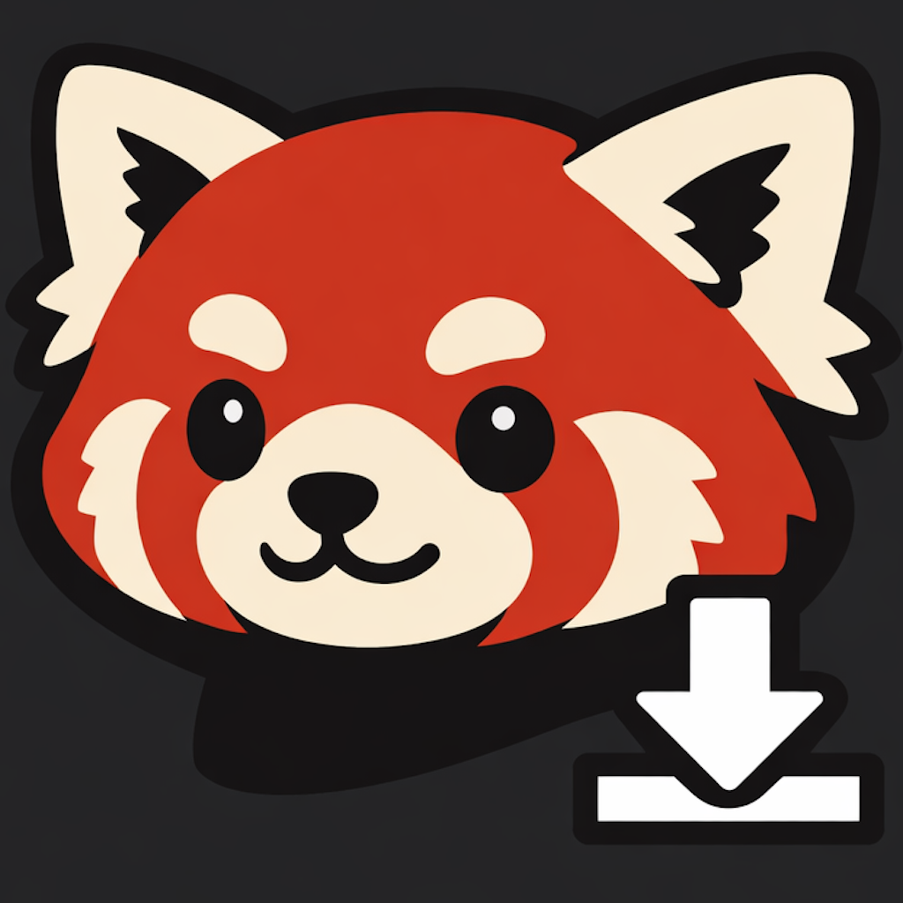
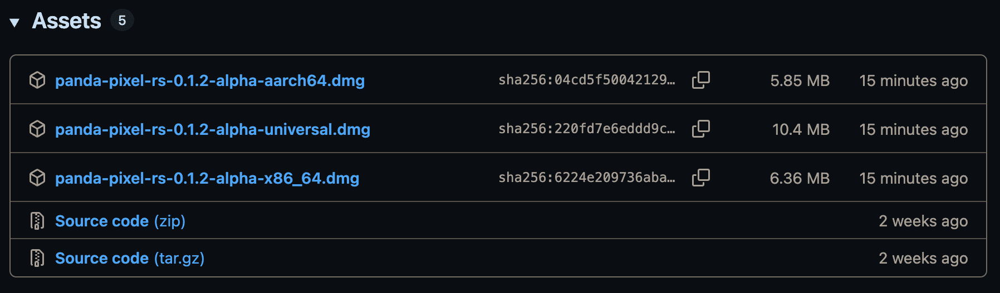
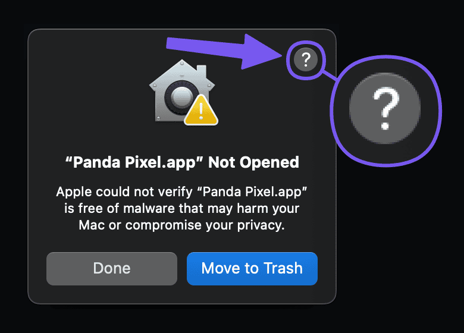
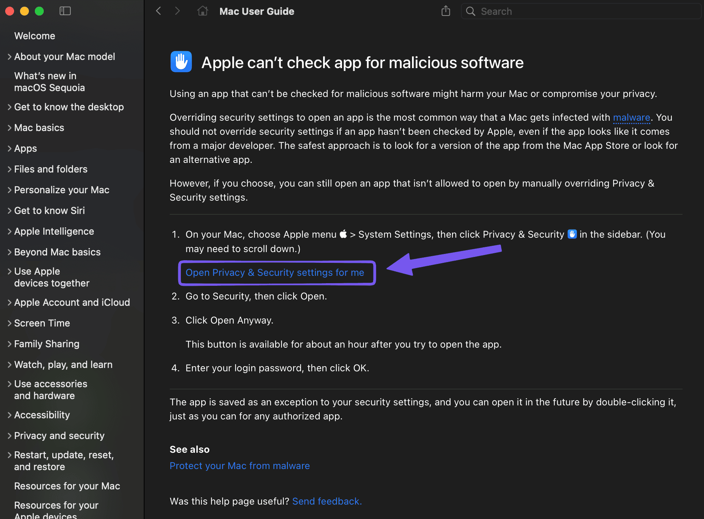
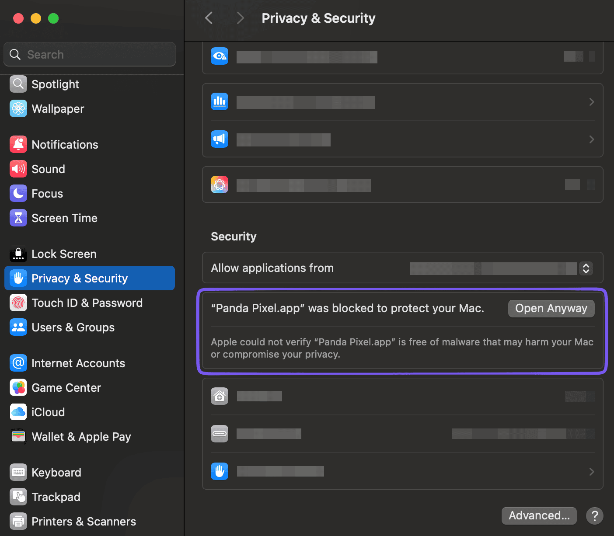

<div align="center">

#  panda-pixel-rs

**Fast, 100% private, AI image compression, corrections, & conversion.**

*TinyPNG clone — a rust Red Panda alternative with bonus features!*

[](https://www.rust-lang.org/)
[](https://www.rust-lang.org/)
[](https://v2.tauri.app/)
[](https://leptos.dev/)
[](LICENSE)

<p align="center">
  <picture>
    <source srcset="assets/UI_1.webp?v=2" type="image/webp">
    
  </picture>
  <br><br>
  <picture>
    <source srcset="assets/UI_2.webp?v=2" type="image/webp">
    
  </picture>
</p>

</div>

---

## 💡 About

Panda Pixel is a local-first desktop image compression, conversion, and correction tool that performs all processing on your machine. It provides TinyPNG-like compression quality with complete privacy and offline operation.

- **Target Platforms**: macOS-first, Windows, Linux
- **Architecture**: Native desktop application (no Electron overhead)
- **Privacy**: 100% local processing - no uploads to external servers
- **Performance**: Native Rust performance with parallel processing

## ✨ Features

- 🚀 **Fast**: Native Rust performance with parallel processing
- 🔒 **Private**: 100% local processing - no uploads to external servers
- 🎨 **Multiple Formats**: PNG, JPEG, WebP, AVIF, TIFF, BMP, ICO, HEIC support
- 💡 **Smart Compression**: TinyPNG-like PNG quantization + oxipng optimization
- 🔄 **Format Conversion**: Convert between all supported formats while maintaining quality
- 🖥️ **Desktop App**: Native desktop application for macOS, Windows, and Linux
- ⚡ **Modern UI**: Built with Leptos for reactive, type-safe frontend
- 📦 **Single Binary**: Standalone desktop app with no dependencies
- 🎯 **Batch Processing**: Compress multiple images with progress tracking
- 🖱️ **Drag & Drop**: Native file drag & drop support
- ⚙️ **Advanced Options**: oxipng optimization, PNG lossy compression

## 🚀 Why Panda Pixel?

Most image compression tools compromise on privacy, performance, or cost:

- **Privacy**: Many tools upload your images to cloud servers
- **Cost**: Cloud services charge per image or have usage limits
- **Performance**: Web-based tools are slower and require internet
- **Transparency**: Closed-source tools don't reveal their algorithms

Panda Pixel eliminates these compromises:

- **Local Processing**: All compression happens on your device
- **Free & Open Source**: No usage limits or subscription fees
- **Fast**: Native Rust performance with parallel processing
- **Transparent**: Fully open source, auditable codebase


## 💻 Usage

### Desktop Application

1. **Select Images**: Click "📁 Select Images" or drag & drop files onto the window
2. **Adjust Compression**: Use the slider to choose quality:
   - **Low**: Best quality (70-90 range)
   - **Mid**: Balanced (50-80 range) - *recommended*
   - **Max**: Smallest file (20-60 range)
3. **Choose Format**: Select output format (Auto, PNG, JPEG, WebP, AVIF, TIFF, BMP, ICO)
4. **Advanced Options** (optional):
   - Enable oxipng optimization
   - Enable PNG lossy compression
5. **Compress/Convert**: Click "Compress/Convert" to process images
6. **Download**: Click "📥 Download All" to save all compressed images to a folder

## ⚡ Quick Start

### Download Latest Release (Recommended)

Download the latest prebuilt binaries from [GitHub Releases](https://github.com/bmurrtech/panda-pixel-rs/releases).

<p align="left">
  
</p>

1. Open the latest release page: [panda-pixel-rs releases](https://github.com/bmurrtech/panda-pixel-rs/releases).
2. Click the **Assets** arrow to expand downloadable files.
3. Download the file for your OS (`aarch64`, `x86_64`, or `universal` on macOS).
4. Install/open the app.

<details>
<summary>🔎 <strong>Click to expand for help with unsigned app warnings & installation issues</strong> ⚠️</summary>

<br/>

### macOS: Handling Unsigned App Warnings

Due to the app being unsigned or untested developer, you will likely see a security warning from Apple/Windows when launching Panda Pixel. This is normal for open source that hasn't gone through Apple's notarization process. **Proceed at your own risk.**

#### How to Open Panda Pixel on macOS:

1. **Double-click the downloaded `.dmg` and drag Panda Pixel into your Applications folder.**

2. **Launch the app:**
   - Open your Applications folder and double-click "Panda Pixel".
   - If you see a "Can't be opened" security message, click the small **“?”** icon in the dialog.

   <p align="left">
     
   </p>

3. **In the message dialog, click "Open Privacy & Security Settings for me".**
   - This takes you directly to the correct settings panel.

   <p align="left">
     
   </p>

4. **Scroll down in Security & Privacy settings until you see a section mentioning "Panda Pixel.app".**
   - Click the **Open Anyway** button to bypass the security block (you will only need to do this once per version).

   <p align="left">
     
   </p>

5. Confirm any prompts as needed. Panda Pixel should now launch.

> _This warning appears because the app is unsigned (not notarized by Apple). This is expected for alpha/test releases. Proceed at your own discretion and risk._

---

#### Windows: SmartScreen Warning

- If you see a Windows SmartScreen warning, click **More info**, then **Run anyway**.

These prompts are expected for unsigned alpha builds and do not indicate a problem with the app.

</details>

If your OS/architecture is not listed in release assets, build from source below.

## Build from Source

1. **Clone the repository**:
   ```bash
   git clone https://github.com/bmurrtech/panda-pixel-rs.git
   cd panda-pixel-rs
   ```

2. **Install Rust** (if not already installed):
   ```bash
   curl --proto '=https' --tlsv1.2 -sSf https://sh.rustup.rs | sh
   ```

3. **One-time tooling** (desktop + Leptos `src/` frontend):

   ```bash
   rustup target add wasm32-unknown-unknown
   cargo install trunk
   cargo install tauri-cli@2.9.1 --locked
   ```

4. **Desktop app**:

   ```bash
   cargo tauri build
   ```

5. **Local Development / Build**

   - **Run Desktop App (dev):**
     - `make dev-desktop`  
       or  
       `cargo tauri dev`
   - **Run Web UI (dev):**
     - `make dev-web`
     - (Usually run `cargo run -p api` in another terminal for API)
   - **Build Desktop Release:**
     - `make build-desktop`  
       or  
       `cargo tauri build`
   - **Troubleshooting:**  
     - See [docs/troubleshooting.md](docs/troubleshooting.md) for solutions to CI/path issues
   - **Reference Docs:**  
     - [Layout, web vs desktop, releases](docs/contributing.md)
     - [Parity matrix](docs/parity-matrix.md)
     - [Tests and checks](docs/testing.md)

### Releases

Releases are tagged with the canonical SemVer format `vMAJOR.MINOR.PATCH[-PRERELEASE]` (e.g. `v1.2.3` or `v0.1.2-alpha`). Pushing such a tag triggers `.github/workflows/release.yml`, which builds artifacts for macOS, Linux, and Windows in parallel and publishes a GitHub Release.

For the full versioning policy, manifest sync rules, and step-by-step release flow, see [Release Process](docs/contributing.md#release-process) in `CONTRIBUTING.md`.

## 🧬 Supported Formats

| Input | Output | Notes |
|-------|--------|-------|
| PNG | PNG, WebP, AVIF, JPEG, TIFF, BMP, ICO | TinyPNG-like quantization |
| JPEG | JPEG, WebP, AVIF, PNG, TIFF, BMP, ICO | mozjpeg optimization |
| HEIC/HEIF | JPEG | Auto-converts like TinyPNG |
| WebP | All formats | Full decode/re-encode |
| TIFF, BMP | All formats | Standard image processing |

## ⚡ Performance

- **PNG**: Uses libimagequant for TinyPNG-like compression + oxipng optimization
- **JPEG**: mozjpeg encoder with progressive mode and trellis quantization
- **WebP**: High-quality lossy encoding optimized for web
- **AVIF**: Modern format with superior compression ratios
- **Parallel Processing**: Automatic CPU detection for optimal performance

## 🧪 Testing

To quickly test the **web** workspace app after making changes:

   - **Terminal 1:** Start the API server
     ```bash
     cargo run -p api
     ```
   - **Terminal 2:** Serve the web frontend (`apps/web`)
     ```bash
     make dev-web
     ```

To validate changes, run the main test suite from the repository root:

```bash
cargo test --workspace
```

Tests cover:
- PNG compression with various quality settings
- JPEG compression
- Format conversions (WebP, AVIF, TIFF, BMP, ICO)
- Quality range parsing
- Compression level presets
> **See the full [Testing Guide](docs/testing.md) for setup, quality gates, workspace, WASM, and troubleshooting instructions.**

## 🛣️ Roadmap

#### Local, Private AI-Powered Image Enhancement

- [ ] **Image Upscaling**: Fast single image super-resolution (SISR) models for ultra high-quality upscaling
  - [ ] **Real-World Images:**
    - [ ] 2x & 4x upscale (e.g. [Xenova/swin2SR-classical-sr-x2-64](https://huggingface.co/Xenova/swin2SR-classical-sr-x2-64), [andrewdalpino/UltraZoom-2X](https://huggingface.co/andrewdalpino/UltraZoom-2X))
  - [ ] **APISR Images (Anime Production Inspired Super-Resolution):**
    - [ ] 4x upscale ([Xenova/4x_APISR_GRL_GAN_generator-onnx](https://huggingface.co/Xenova/4x_APISR_GRL_GAN_generator-onnx))
- [ ] **Resolution Improvement**: AI-powered enhancement to improve image quality while compressing

- [ ] **ONNX Runtime Integration**: Using [ort](https://ort.pyke.io/) for optimized ONNX model inference
  - [ ] Hardware acceleration support (CUDA, TensorRT, OpenVINO, QNN, CANN)
  - [ ] Efficient I/O binding for optimal performance
  - [ ] Cross-platform deployment including WASM support

#### Local, Private AI-Powered Background Removal

- [ ] **Commercial-Use Background Removal**: Local ONNX models for Bilateral Reference for High-Resolution Dichotomous Image Segmentation ([BiRefNet](https://github.com/ZhengPeng7/BiRefNet))
  - [ ] Optional mask output (mask can be created and saved, in addition to the removed-background image)
- [ ] **Non-Commercial Background Removal**: Local ONNX model ([briaai/RMBG-1.4](https://huggingface.co/briaai/RMBG-1.4)) for personal and non-commercial use

## ⭐ Acknowledgments

- **[libimagequant](https://pngquant.org/lib/)**: For TinyPNG-like PNG quantization
- **[oxipng](https://github.com/shssoichiro/oxipng)**: For PNG optimization
- **[mozjpeg](https://github.com/mozilla/mozjpeg)**: For JPEG compression
- **[Leptos](https://leptos.dev/)**: For Rust-compatible, reactive, type-safe frontend framework
- **[Trunk](https://trunkrs.dev/)**: For building, bundling, & shipping of Rust WASM applications to the web
- **[Tauri](https://tauri.app/)**: For Rust-based lightweight desktop application framework
- **[ort](https://ort.pyke.io/)**: ort is an open-source Rust binding for ONNX Runtime.
- **[APISR: Anime Production Inspired Real-World Anime Super-Resolution](https://github.com/Kiteretsu77/APISR)**: For APISR SISR models
- **[BiRefNet](https://github.com/ZhengPeng7/BiRefNet)**: For high-resolution AI background removal
- **[ONNX Runtime](https://onnxruntime.ai/)**: The Open Neural Network Exchange (ONNX) is an open standard for representing machine learning models.
- **[Optimum ONNX](https://github.com/huggingface/optimum-onnx)**: Enables exporting models to ONNX and running inference with ONNX Runtime.
- **[onnxruntime-web](https://www.npmjs.com/package/onnxruntime-web)**: Enables WebGPU-accelerated ONNX inference in browsers—just set `device: 'webgpu'`.
- **[Hugging Face ONNX Community](https://huggingface.co/onnx-community)**: For a growing library of ONNX format models.
- **[Xenova](https://huggingface.co/Xenova)**: For ONNX upscaling models and pioneering `Transformers.js`
- **[Hugging Face Transformers.js](https://github.com/huggingface/transformers.js)**: For powerful WebGPU-accelerated model support (WebGL successor).

## 📄 License

Open source under the **GNU AGPLv3**—see [LICENSE](LICENSE) for terms.

### License Philosophy (Plain English)

This project is licensed under GNU AGPLv3.

That means:

- **You may use it commercially.**
- **You may build a paid SaaS product with it.**
- **You may modify it.**

However:

- **Hosted Service or SaaS:** If you run this software as part of a hosted service or SaaS product, you must provide your users access to the corresponding source code, including any modifications you have made.
- **Distribution:** If you distribute this software (or a derivative), you must include the same license and provide source code.
- **Openness:** This ensures improvements remain **open** and the community benefits from derivative work.

If you want to use this project in a proprietary or closed-source product without AGPL obligations, a commercial license is available.

#### Commercial / Proprietary Licensing

Need any of the following?
- Commercial use **without** copyleft obligations
- Proprietary or closed-source usage
- SaaS or hosted deployment without source disclosure
- Embedded or internal distribution without attribution

**Commercial licenses are available.**

These licenses waive AGPL-3.0 copyleft requirements, including:
- No obligation to publish source code
- No public attribution requirements
- SaaS, hosted, and embedded use allowed

**How to obtain a commercial license:**
_Open a GitHub Issue in this project’s repository to contact the maintainers for licensing and pricing details._

## 🤝 Contributing

Please see [docs/contributing.md](docs/contributing.md) for setup, layout, web vs desktop, and PR expectations. See [docs/testing.md](docs/testing.md) for `cargo test`, Clippy/fmt, WASM checks, and smoke workflows.
